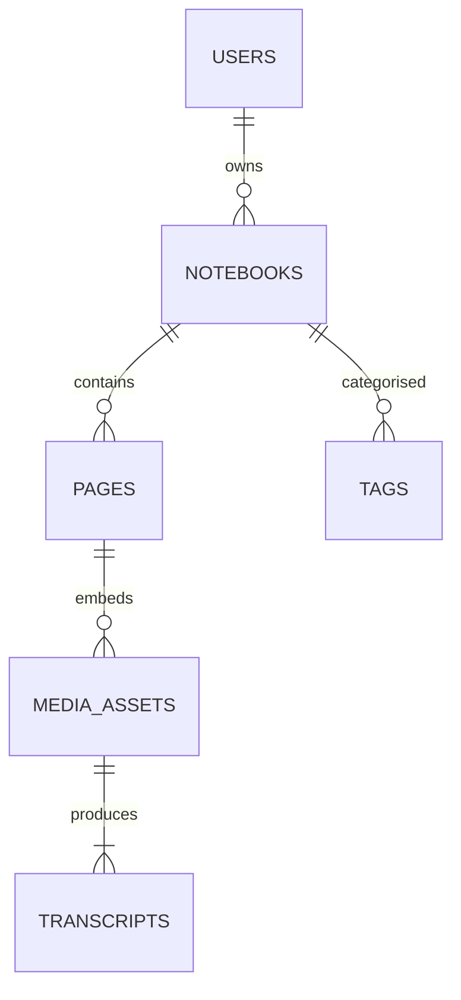

# しゃべるノート – バックエンド技術仕様 

## 1. アーキテクチャ概観
```mermaid
graph LR
m(Expo App) -- HTTPS / WS(ID Token) --> A[Cloud Endpoints (ESPv2)]
A --> B[Firebase Auth (ID Token verify)]
A --> C[Notes Service (FastAPI)]
A --> D[Media Service]
A --> E[AI Service]
D --> G[Cloud Storage]
C --> F[(Cloud SQL PostgreSQL)]
E --> H(OpenAI / GCP APIs)
```

### 採用技術スタック
| レイヤ | 技術 / サービス |
|--------|----------------|
| API 認証 | **Firebase Authentication** (Google / Apple SSO) |
| 実行基盤 | **Cloud Run** (g1‑small, min = 0) |
| 言語 / FW | Python 3.12 + **FastAPI** |
| DB | Cloud SQL (PostgreSQL 15) + SQLAlchemy |
| ストレージ | Cloud Storage (audio/, images/, pdf/) |
| メッセージング | Pub/Sub (`media.new`, `stt.done`) |
| 外部 API | Google Cloud Speech‑to‑Text / Text‑to‑Speech, Vision API, OpenAI GPT‑4o, Yahoo! テキスト解析, Google CSE |
| インフラ管理 | Terraform 1.8 (IaC) |
| CI/CD | GitHub Actions → Cloud Buildpacks → Cloud Run |

> **認証フロー**  
> 1. クライアントは Firebase Auth で Sign‑In → **ID Token** を取得  
> 2. 各 REST / WS 要求に `Authorization: Bearer <ID_TOKEN>` を付与  
> 3. Cloud Endpoints (ESPv2) が公開鍵で検証し、検証済みクレームを FastAPI へ転送 – サーバ側で `firebase‑admin` による 2nd verify も可  
>
> **ローカル開発環境用認証バイパス**  
> * 開発環境では `.env` に `DEBUG=true` および `BYPASS_AUTH=true` を設定することで認証をバイパス可能  
> * バイパス有効時はテストユーザー情報（`uid: test-user-id`）が自動的に使用される  
> * **本番環境では必ず `BYPASS_AUTH=false` とすること**  

## 2. REST / WebSocket API 仕様 (v1)

| # | Method | Path | 説明 | 認証 | 主処理 |
|---|--------|------|------|------|--------|
| 1 | GET | `/notebooks` | ノート一覧 | Firebase ID Token | DB Query |
| 2 | POST | `/notebooks` | ノート作成 | ✅ | Insert |
| 3 | PATCH | `/notebooks/{id}` | ノート更新 | ✅ | Update |
| 4 | DELETE | `/notebooks/{id}` | ノート削除 (soft) | ✅ | Update `deleted_at` |
| 5 | GET | `/pages/{id}` | ページ取得 | ✅ | Join canvas / transcripts |
| 6 | PUT | `/pages/{id}/canvas` | キャンバス JSON 更新 | ✅ | Store in DB |
| 7 | POST | `/media/upload-url` | 署名付き URL 発行 | ✅ | GCS v4 Signed URL |
| 8 | POST | `/media/upload-chunk` | チャンク分割アップロード | ✅ | 大容量ファイル対応 |
| 9 | POST | `/media/complete-upload` | チャンクアップロード完了 | ✅ | チャンク結合と処理開始 |
| 10 | GET | `/media/{id}/status` | STT / OCR 進行状況 | ✅ | 進捗状況と結果取得 |
| 11 | POST | `/ai/chat` | AI チャット | ✅ | GPT‑4o proxy |
| 12 | WS | `/stt/stream` | 60 秒音声ストリーム → STT 同期 | ✅ | Bidirectional Streaming |

*全 API は OpenAPI 3.1 仕様書 `/openapi.json` で配布。*

### 共通ヘッダ
```
Authorization: Bearer <Firebase_ID_Token>
Content-Type: application/json
```

## 3. データベーススキーマ

(※テーブル定義は前版と同一／`users` 行を Firebase UID に変更)

## 4. メディア処理パイプライン
1. **署名 URL** を取得 → クライアント PUT(Resumable)  
2. オブジェクト Finalize → Pub/Sub `media.new`  
3. `media-worker` (Cloud Run Jobs)  
   * audio ⇒ Speech‑to‑Text (async)  
   * image/pdf ⇒ Vision OCR  
4. 結果を DB 保存し、`media.{id}.done` イベント  
5. クライアントはポーリングまたは FCM データメッセージで完了を受信  

## 5. セキュリティ & ガバナンス
* Firebase Rules による object path ベース権限制御  
* Cloud SQL IAM authn / SC 構成  
* 脆弱性スキャン (Container Analysis)  

## 6. 観測性 & 運用
* Cloud Trace / Profiler / Logging  
* SLO: p95 レイテンシ < 400 ms、Error rate < 1 %  
* Autorecovery: deploy‑rollback on 3 × 5 min 5xx spike  

---

## 7. ストレージ設計

### メディアファイルの管理

* メディアファイルは Cloud Storage に保存
* パス形式: `gs://talknote-media/{uid}/{media_id}.{ext}`
* メタデータは PostgreSQL に保存
  * `media` テーブル: `id`, `user_id`, `type`, `status`, `created_at`, `updated_at`, `metadata`
  * `metadata` は JSONB 型で、メディア種別によって異なるメタデータを染込可能

### ストレージ抽象化レイヤー

* `app/providers/storage/` 配下に抽象化レイヤーを実装
* 環境変数 `STORAGE_PROVIDER=local|gcs` でプロバイダー切替
* 主要クラス：
  * `StorageProvider` (抽象ベースクラス)
  * `LocalStorageProvider` (ローカル開発用)
  * `GCSStorageProvider` (Google Cloud Storage 用)

### 大容量ファイルのチャンク分割アップロード

長時間録音ファイル (90分まで) に対応するため、チャンク分割アップロードを実装。

#### API仕様

1. **アップロード初期化** (`POST /media/upload-url`)

```json
// リクエスト
{
  "file_type": "audio/wav",
  "file_size": 1024000,
  "chunk_size": 5242880,  // 5MBチャンクを使用する場合
  "total_chunks": 3       // 全チャンク数（オプション）
}

// レスポンス
{
  "media_id": "550e8400-e29b-41d4-a716-446655440000",
  "upload_url": "https://...",  // 小ファイル用の直接アップロードURL
  "chunk_upload_enabled": true,   // チャンクアップロードが必要か
  "max_chunk_size": 5242880      // 最大チャンクサイズ（5MB）
}
```

2. **チャンクアップロード** (`POST /media/upload-chunk`)

```json
// リクエスト (multipart/form-data)
{
  "media_id": "550e8400-e29b-41d4-a716-446655440000",
  "chunk_index": 0,  // 0から始まるチャンク番号
  "total_chunks": 3, // 全チャンク数
  "chunk": [binary data]  // バイナリデータ
}

// レスポンス
{
  "media_id": "550e8400-e29b-41d4-a716-446655440000",
  "chunk_index": 0,
  "received_bytes": 5242880,
  "status": "success"
}
```

3. **アップロード完了** (`POST /media/complete-upload`)

```json
// リクエスト
{
  "media_id": "550e8400-e29b-41d4-a716-446655440000",
  "total_chunks": 3,
  "total_size": 15728640,
  "md5_hash": "d41d8cd98f00b204e9800998ecf8427e"  // オプション（整合性チェック用）
}

// レスポンス
{
  "media_id": "550e8400-e29b-41d4-a716-446655440000",
  "status": "processing",
  "progress": 0.0
}
```

4. **処理状況確認** (`GET /media/{id}/status`)

```json
// レスポンス
{
  "media_id": "550e8400-e29b-41d4-a716-446655440000",
  "status": "processing|completed|error",
  "progress": 0.75,  // 0.0〜1.0の進捗度
  "error": null,     // エラー時のみ値を設定
  "result": {        // completed時のみ値を設定
    "transcript": "...",
    "duration": 90.5,
    "language": "ja-JP"
  }
}
```

#### クライアント実装ガイド

1. ファイルサイズに基づく判断：
   - 5MB未満：直接アップロードURLを使用
   - 5MB以上：チャンク分割アップロードを使用

2. チャンク分割アップロード手順：
   - ファイルを指定サイズ（5MB推奨）のチャンクに分割
   - 各チャンクを順番にアップロード
   - 全チャンクのアップロード完了後、complete-uploadを呼び出す

3. プログレス表示：
   - アップロード中：チャンク数に基づく進捗表示
   - 処理中：`/media/{id}/status` を定期的にポーリングし、progress値を表示

4. エラー処理：
   - チャンクアップロード失敗時：同じチャンクを再送可能
   - タイムアウト発生時：リトライロジックを実装

---
