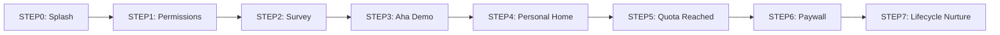

# しゃべるノート – オンボーディング & 課金フロー仕様書 (v1.0)
作成日: 2025-06-02

---

## 0. 目的
- **KGI**: インストールユーザーの **10 %** がサブスクリプションへ転換
- 対象ユーザー: ディスレクシア／ディスグラフィア当事者・保護者・教育関係者
- 前提: コア機能 (音声⇄文字⇄手書き) が実装済み、UX は改善余地あり

---

## 1. 成功原則 (5 Pillars)
| # | 原則 | 要点 |
|---|------|------|
| 1 | **90 秒以内に “Aha!” 体験** | 初回デモで価値を即理解させる |
| 2 | **ペインを数値化し可視化** | 例: “6 分47 秒を削減” |
| 3 | **ミクロ・パーソナライズ** | Survey → UI 要素を動的置換 |
| 4 | **行動直後ペイウォール** | 心理距離 0 のタイミングで課金提示 |
| 5 | **習慣化をコミュニケーションで支援** | D+1/3/5/6/7 で Push / メール |

---

## 2. オンボーディング〜課金フロー（7 ステップ）


---

### STEP0: Brand Splash (3 秒)
| 項目 | 仕様 |
|------|------|
| 画面 | ブランドロゴ + タグライン + Lottie (手書き→音声波形) |
| ロジック | `AsyncStorage.getItem('first_launch')` 判定 |

STEP 0　インストール直後 ― Brand Splash（3 秒）
| 項目            | 内容                                                              
| **画面構成**      | ①ブランドロゴ（SVG、96 × 96）<br>②タグライン「書かずに“聴く”学習を、今すぐ」<br>③Lottieアニメーション：手書き→音声波形までの変化（ループ） |
| **コピー例**      | *“耳で学ぶ時代へようこそ”*                                                                      |
| **プロダクトロジック** | - アプリ初起動判定：`AsyncStorage.getItem('first_launch')`<br>- 2 秒経過でプリロードが完了していれば次画面へ       |
| **計測イベント**    | `onboarding_start`                                                                   |
| **エッジケース**    | ・オフライン…キャッシュ済みイラストのみ表示。進行は継続<br>・初回でない…STEP 0 をスキップ                         

---

### STEP1: Permissions (合計≈10 秒)
| 許可 | コピー例 | 目標許諾率 |
|------|----------|-----------|
| マイク | 「声だけでノートが取れます」 | ≥ 85 % |
| 通知 | 「締切リマインドをお届け」 | ≥ 60 % |
| 写真 | 「教材を撮るだけでテキスト化」 | ≥ 75 % |

| 要素           | 内容                                                            |
| ------------ | ------------------------------------------------------------- |
| **UI**       | ①アイコン（マイク）②ベネフィットテキスト<br>③「続ける」= プライミング → iOS/Android 標準ダイアログ |
| **コピー例**     | *「声だけで 1 時間分のノートが取れます。マイクを許可してください。」*                         |
| **計測**       | `perm_mic_granted` / `perm_mic_denied`                        |
| **Fallback** | 否認の場合：ノート作成時に再度リクエスト & コーチマーク表示                               |
許諾率目標：マイク≥85 %、通知≥60 %、ギャラリー≥75 %


---

### STEP2: Quick Survey (30 秒)
- **設問**  
  1. 利用者タイプ (本人／保護者／教師)  
  2. 目標 (テスト勉強／読書／講義録音／仕事メモ)  
  3. 学習スタイル (音で聴く／図で覚える／反復で覚える)  
- **データ保存**: `UserProfileContext` に `{role, goal, style[]}`  
- **分岐**: 画面遷移は一本化し、STEP3 で動的に文言・Voice を差し替え  

STEP 2　クイックサーベイ（所要 30 秒）
| 質問      | 型      | 選択肢例               | 用途           |
| ------- | ------ | ------------------ | ------------ |
| ①利用者タイプ | シングル選択 | 本人／保護者／教師          | パーソナライズ文面    |
| ②目標     | シングル選択 | テスト勉強／読書／講義録音／仕事メモ | ホームのテンプレート   |
| ③学習スタイル | 複数選択   | 音で聴く／図で覚える／反復で覚える  | 機能チュートリアル優先度 |

UI：react-native-paper の RadioButton.Group＋プログレスバー（30 %, 60 %, 100 %）

スキップ：右上テキストボタン、タップ時に survey_skipped=1 を付与

計測：survey_complete, survey_skip_stepX

---

### STEP3: “Aha!” Demo (60 秒)
| フェーズ | UI 要素 | 処理 |
|----------|---------|------|
| 録音 (10s) | Fab 長押し | `expo-av` 16 kHz |
| テキスト化 (≈3s) | Skeleton → Text | `openai.audio.transcriptions` |
| TTS 再生 | ▶︎ ボタン | `expo-speech` (Voice = 動的) |
| KPI 表示 | 例: “3 分で1,000文字を耳学習” | `kpiCopy` 動的差し替え |

STEP 3　“Aha!” 実演（合計 60 秒）
| フェーズ                 | 画面要素                                      | 所要   | UX 仕様                             |
| -------------------- | ----------------------------------------- | ---- | --------------------------------- |
| **3-A** 録音           | ●中央に Fab 録音ボタン（長押しで録音）<br>●上部にカウントアップタイマー | 10 秒 | `expo-av` で 16 kHz 録音             |
| **3-B** 自動テキスト化      | ●録音停止後、Skeleton→文字列<br>●重要単語にアニメーション下線    | 3 秒  | STT＝`openai.audio.transcriptions` |
| **3-C** 1-タップ TTS    | ●テキスト下に `▶︎ 聴く` ボタン                       | 3 秒  | `expo-speech`、Voice=jp-Joanna     |
| **3-D** “Aha!” ダイアログ | ●タイトル「手は使わず、理解は倍速。」<br>●続ける CTA           | 2 秒  |                                   |

計測：aha_start → aha_done（完走率目標 ≥ 85 %）

失敗時：録音失敗 → “電波が弱いようです、もう一度” と再試行ボタン

---

### STEP4: Personal Home (≈15 秒)
- KPI Card: `time_saved` を計算表示  
- Starter Tiles: Survey 目標に合わせ並び替え  
- Tips Carousel: 学習スタイルに応じ GIF 切替  

STEP 4　パーソナルホーム生成（15 秒）
| 区域                | 要素                 | パーソナライズ例                         |
| ----------------- | ------------------ | -------------------------------- |
| **Header**        | ようこそ, {名前} さん      | 保護者なら “お子さま” 表記                  |
| **KPI Card**      | 今日の時短 **6 分 47 秒** | `time_saved` = (文字数÷読字速度) – 録音時間 |
| **Starter Tiles** | 「教材を撮影」「今日の録音」     | サーベイ ②結果で順序変更                    |
| **Tips Carousel** | GIF ×3 (タブで操作方法紹介) | スタイル選好                           |

インテント：ユーザーが 自発的に 第1ノートを作る

計測：home_first_visit, note_create_1st

---

### STEP5: Quota Reached (ノート3枚到達)
- Banner: “無料枠 3/3 枚を使い切りました”  
- Modal: Free vs Premium 比較表 + “7 日間無料” バッジ  
- 計測: `quota_reached`, `quota_modal_accept`  

STEP 5　使用上限到達（トリガー：3 枚目のノート保存）
| UI                  | UX 仕様                                                               |
| ------------------- | ------------------------------------------------------------------- |
| **Progress Banner** | *“無料枠 3 / 3 枚を使い切りました”*                                             |
| **モーダル**            | ①比較表（Free vs Premium）<br>②「あと 7 日は全機能無料」バッジ<br>③CTA “続けてフリートライアル開始” |
| **行動指標**            | 上限到達率 25 %、モーダル表示→Paywall 遷移率 100 %                                 |
学習ログ保持：有料でなくてもデータ保存を保証し Fear of Loss を低減

計測：quota_reached, quota_modal_accept, quota_modal_dismiss

---

### STEP6: Paywall
| セクション | 内容 |
|-----------|------|
| Hero | 「書かずに聴く学習を、続けよう」 |
| プラン | 年間 ¥5,760（中央強調）／月間 ¥1,200 |
| ベネフィット | ✓ 時短 ✓ 疲労軽減 ✓ AI 学習分析 |
| 社会的証明 | ★4.6、成功事例 |
| CTA | 「7 日間無料で始める」 (RevenueCat) |
| 目標 | Paywall→購入 CTR ≥ 40 % |

STEP 6　ペイウォール（心理距離 = 0）
| セクション          | 内容                                     | UX 要件                             |
| -------------- | -------------------------------------- | --------------------------------- |
| **Hero**       | “書かずに聴く学習を、続けよう”                       | UD デジタル教科書体 24 pt                 |
| **プランカード**     | <br>**年間**：¥5,760<br>**月間**：¥1,200     | 年間カードを中央＆強調枠                      |
| **ベネフィット箇条書き** | ✓ ノート無制限<br>✓ AI 学習ログ分析<br>✓ オフライン TTS | 順序＝時短→疲労軽減→理解向上                   |
| **社会的証明**      | ★4.6 (App Store)、保護者 80 % が「学習が楽に」     | `react-native-star-rating-widget` |
| **決済 CTA**     | 「7 日間無料ではじめる」                          | 1 タップ購入＋Restore                   |
| **法律テキスト**     | サブスクリプション条件、解約方法リンク                    | iOS: `StoreKit` 自動処理              |

AB 変数：ヒーローコピー vs 実績数字訴求

計測：paywall_show, purchase_success, purchase_fail (code)

ターゲット数値：Paywall→購入 CTR ≥ 40 %
---

### STEP7: Lifecycle Nurture (Trial 7 日)
| Day | チャネル | コンテンツ例 |
|-----|----------|--------------|
| 1 | Push | “昨日 1,137 文字を耳学習しました！” |
| 3 | メール | 保護者向け成功事例 |
| 5 | In-App | 未使用機能の Coachmark |
| 6 | Push | “残り24時間：50%OFF” |
| 7 | Paywall 再表示 | トライアル終了バナー |

STEP 7　ライフサイクル Nurture（トライアル期 7 日）
| 日次            | チャネル          | 自動トリガー & コピー例                          |
| ------------- | ------------- | -------------------------------------- |
| **D+1 09:00** | プッシュ          | *「昨日は 1,137 文字を“聴き学習”しました！今日も続けませんか？」* |
| **D+3 18:00** | メール           | *保護者向け成功事例：大学生 A さんはテスト時間 30 % 短縮*     |
| **D+5 インアプリ** | Coachmark     | まだ TTS 未使用の人に “音速ハイライト機能を試しましょう”       |
| **D+6 20:00** | プッシュ          | *「残り 24 時間：50 % OFF で年間プランへ切替可」*       |
| **D+7 08:00** | Paywall (再表示) | トライアル終了当日、上部バナー固定                      |

キャンセル防止：iOS TransactionObserver で didChangeRenewalStatus → 即時アンケート

計測：trial_to_paid, churn_within_trial

---

## 3. 可変コンテンツマトリクス
| role | voicePrompt | ttsVoice | kpiCopy |
|------|-------------|----------|---------|
| student | レポートの要点をまとめます | jp‑Joanna (0.9) | 3 分で1,000文字を耳学習 |
| parent  | 漢字テストの練習を始めます | jp‑Keita (0.8)  | お子さまの学習時間を30％削減 |
| teacher | 今日の授業内容を録音します | jp‑Mizuki (1.0) | 講義ノート作成を自動化 |

メトリクス実装（Amplitude イベント定義）
| イベント名                | Properties (例)                                     |         |                              |
| -------------------- | -------------------------------------------------- | ------- | ---------------------------- |
| `note_create`        | \`{method: 'voice'                                 | 'photo' | 'typing', length\_sec: 62}\` |
| `quota_modal_accept` | `{plan_default: 'annual', experiment_id: 'PW_v2'}` |         |                              |
| `purchase_success`   | `{plan: 'annual', price: 5760, currency: 'JPY'}`   |         |                              |
ダッシュボードテンプレ：ファネル＝onboarding_start → aha_done → quota_reached → paywall_show → purchase_success

---

## 4. 実装アーキテクチャ概要
```text
React Native + Expo
├─ Navigation: createNativeStackNavigator
├─ Context: UserProfileContext (role / goal / style)
├─ A/B: expo-updates + experiments.json
├─ Analytics: Amplitude
└─ Purchases: RevenueCat (StoreKit / BillingClient)
```

---

## 5. 計測イベント定義 (Amplitude)
| Event | Properties |
|-------|------------|
| onboarding_start | – |
| perm_mic_granted | – |
| survey_complete | {role, goal} |
| aha_done | {role} |
| quota_reached | {note_count:3} |
| paywall_show | {experiment_id} |
| purchase_success | {plan:'annual', price:5760} |

---

実装ロードマップ（抜粋）
UI Kit：React Native Paper v6 + Tailwind-RN

Lottie：lottie-react-native 6.x（Splash, KPI Card）

A/B 基盤：expo-updates, experiments.json + Amplitude.ConfigurablePlan

Paywall：react-native-purchases（RevenueCat）で StoreKit & Google Play 双方対応

Push：Braze → Expo Notification Gateway（iOS 静的カテゴリ登録）

---

### 付録 A. TypeScript Snippet
```tsx
const { role } = useContext(UserProfileContext)!;
const { voicePrompt, ttsVoice, kpiCopy } = CONTENT[role];

<Text>{kpiCopy}</Text>
<Button title="▶︎ 聴く" onPress={() => Speech.speak(transcript, ttsVoice)} />
```

---

*Copyright © JIKKEN LLC.*
