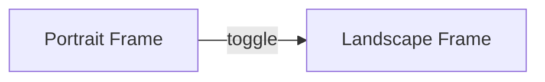

# 📸 PhotoScan Multi-Page & Landscape Support – Implementation Plan

> 最終更新: 2025-07-05
>
> 対象バージョン: FE 1.4.0 / BE 1.3.0 以降

---

## 1. ゴール
1. 写真スキャンで撮影・選択した **最大 10 枚** を 1 ノートの **10 ページまで** にマッピングする。
2. 撮影枠を **縦（Portrait）/横（Landscape）** トグル式に拡張し、横向き画像でも OCR 精度を担保する。
3. 既存の PhotoScan ワークフロー（逐次 *OCR → AI 整形 → プレビュー*）と **Backend OCR API** を温存し、副作用ゼロで導入する。

---

## 2. 影響範囲まとめ
| レイヤ | 主要ファイル | 変更種別 | 後方互換 |
|--------|--------------|----------|-----------|
| FE UI  | `app/screens/PhotoScanScreen.tsx` | **改修**: 撮影枠トグル・ページ分割保存 | 既存 manual/import 動作不変 |
| FE サービス | `app/services/UniversalNoteService.ts` | **改修**: `createPhotoScanNote()` 追加 | 他ノートタイプ不変 |
| BE API | `backend/app/services/ocr.py` (既存) | **変更なし** | – |
| BE OCR Provider | `backend/app/providers/ocr/google_vision.py` | **追記**: `desiredRotation` サポート | 他呼び出しに影響なし |
| BE Note Service | `backend/app/services/page.py` 等 | **拡張**: `save_photo_pages()` | 既存 manual/import/savePageOnly 不変 |
| Storage | `GCSStorageProvider` | **微修正**: `{noteId}/{pageId}.jpg` パス | 既存パスと衝突しない |

---

## 3. 既存実装サマリー（確認済み）
1. **OCR エンドポイント**: `POST /api/v1/ocr/extract-text-base64` – 画像 Base64 を受け取り `OCRService.extract_text_from_image()` に委譲。
2. **OCRService**: Google Vision プロバイダーのみ初期化。画像を検証し `provider.extract_text()` 実行。
3. **GoogleVisionOCRProvider.extract_text()**: `document_text_detection` 呼び出し。`image_context.language_hints` までサポート。
4. **PhotoScanScreen** (FE)
   - `takePicture()` / `addFromGallery()` で Base64 生成 → OCR API → AI 整形 → `capturedPhotos[].ocrResult` に保持。
   - `openInNote()` 現行: 全 OCR テキストを結合し **単一ノート 1 ページ** で `savePhotoScan()` (SQLite) へ保存。

これにより **既存フローを変更せず** に「複数ページ化」と「横向き撮影」を追加できることを確認。

---

## 4. 仕様詳細
### 4.1 データモデル
`types/UniversalNote.ts` – 既に `pages[]` サポートあり。PhotoScan 用メタ:
```ts
pageMetadata: {
  photoUri?: string;
  ocrResult?: OCRResult;
  orientation?: 'portrait' | 'landscape';
  aiProcessed?: boolean;
}
```

### 4.2 撮影枠 UI

- `orientation` state (`'portrait'|'landscape'`) を追加。
- トグルボタン: `Ionicons swap-horizontal-outline`。
- フレーム比率: Portrait = 3:4, Landscape = 4:3。

### 4.3 OCR 呼び出し
- 画像は従来どおり `Base64 JPEG` で送信。
- **Landscape** の場合は フロントで `rotate(90)` 済み画像を送る **OR** Vision API `image_context` に
  ```python
  image_context = vision.ImageContext(
      language_hints=language_hints,
      desired_rotation=90
  )
  ```
  を追加。（後者を採用）
- `PhotoScanScreen.processOCR()` に `orientation` を引数で渡し、`desired_rotation` を `language_hints` と同列で JSON に含める。
- BE `GoogleVisionOCRProvider.extract_text()`
  - `desired_rotation` が渡された場合 `image_context` に設定。

### 4.4 ノート作成フロー
1. 撮影 / ギャラリー追加ごとに **逐次 OCR → AI 整形** (現行維持)。
2. `openInNote()` を以下に変更:
   - ループで `capturedPhotos` を **ページ単位** にマッピング⇒ `pagesPayload`。
   - `UniversalNoteService.createPhotoScanNote(pagesPayload)` へ送信。
   - レスポンスで返る `noteId` で Dashboard へ遷移。
3. `createPhotoScanNote()` は内部で:
   - 新規 noteId 発行 → ノートレコード作成
   - 写真枚数ぶん `pageService.save_photo_page()` を呼び 1 ページずつ保存。
   - GCS パス `{noteId}/{pageId}.jpg` へ非同期アップロード (Backend worker流用)。

---

## 5. 互換性・安全策
- **旧ノート表示**: `pages.length === 1` なら現行ロジックで問題なし。
- **DB Migration**: 既に `pages` テーブル実装済み、PhotoScan も同スキーマを使用するため **マイグレーション不要**。
- **Feature Flag**: `PHOTO_SCAN_MULTIPAGE=true` を `.env` で切替可能にし、段階的ロールアウト。
- **Rollback**: Flag を `false` に戻すと 1 ページ保存のみ有効化 → 旧コードパスへフォールバック。

---

## 6. 実装ステップ & 所要見積
| # | タスク | 担当 | 時間 |
|---|--------|------|------|
| 1 | Provider: `desired_rotation` param 追加 | BE | 0.5h |
| 2 | `UniversalNoteService.createPhotoScanNote` 実装 | BE | 2h |
| 3 | `save_photo_page()` ヘルパー実装 | BE | 1h |
| 4 | PhotoScanScreen: orientation トグル UI | FE | 1h |
| 5 | PhotoScanScreen: OCR 呼び出し param 拡張 | FE | 1h |
| 6 | PhotoScanScreen: openInNote() を multi-page 保存に変更 | FE | 2h |
| 7 | StorageProvider: GCS path 変更 | BE | 0.5h |
| 8 | E2E / unit tests 追加 (Photo 3 枚→3P) | FE/BE | 2h |
| 9 | Feature Flag & docs 更新 | BE | 0.5h |
| **Total** | | | **10.5 h** |

---

## 7. テスト計画
- **Unit**: Provider rotation, createPhotoScanNote page count.
- **Integration**: API → DB で pages=3 保存確認。
- **E2E (Detox)**: 撮影(P+L混在)→OCR→AI→ノート作成→3ページ表示。
- **Regression**: manual/import 録画ノートが問題無いこと。

---

## 8. リリース手順
1. `.env.dev` に `PHOTO_SCAN_MULTIPAGE=true` を設定して dev 環境で QA。
2. EAS Update で β テスターへ配布。
3. メトリクス (page.count >1) が期待どおりか確認。
4. 1 週間問題なければ prod にも Flag 有効化 → 本番リリース。

---

## 9. 既知の課題 / 今後の改善
- **OCR 精度**: Landscape 画像で誤検出がある場合は 180° 回転や裁断アルゴリズム調整を検討。
- **アップロード同時実行**: 10 枚一括の場合 GCS 署名 URL 発行数が増える。将来的には Batch 署名 API を検討。
- **AI 整形速度**: 10 枚連続呼び出しで待機時間が長い場合、バックエンド側で Queue 化 & Webhook 通知に移行する案あり。

---

### 完了基準 (DoD)
- PhotoScan ノートで **複数ページ** が保存・復帰できる。
- Landscape 写真でも OCR 文字が正しい向きで抽出される。
- 既存 manual/import ノートに一切影響が無い。
- E2E シナリオ (Photo 3 枚) が Green。

---

> 上記プランで実装を進めます。疑問・追加要望があればフィードバックをお願いします 🙌 