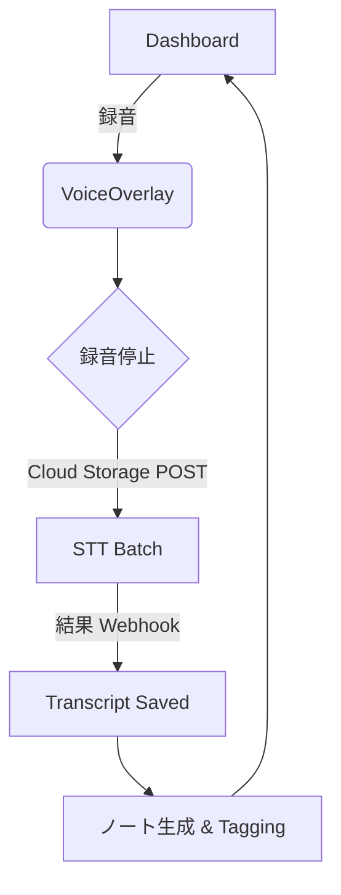

# しゃべるノート – Product Requirements Document (PRD)

## 1. 概要
* **プロダクト名**: しゃべるノート  
* **対象**: ディスレクシア／ディスグラフィアなど読み書きに困難を抱える学生・社会人  
* **プラットフォーム**: iOS / Android（React Native Expo）  
* **リリース形態**: スマートフォン・タブレット両対応（ユニバーサルバイナリ）  
* **バックエンド**: Google Cloud Run + Cloud SQL (PostgreSQL) + Cloud Storage  
* **主要 API**: Google Cloud Speech‑to‑Text / Text‑to‑Speech, Cloud Vision, OpenAI GPT‑4o, Yahoo! Japan Text Analysis, Anthropic Search API 
* **目的**: “読む・書く” をマルチモーダルにサポートし、学習ストレスを軽減するノートアプリを提供する。

## 2. 課題と機会
| # | 読み書き障害者のペインポイント | しゃべるノートが提供する解決策 |
|---|--------------------------------|--------------------------------|
| 1 | 文字情報の理解が困難           | **リアルタイム TTS / STT** により音声 ⇄ 文字を即時変換 |
| 2 | 手書き・外部資料の一元管理が困難 | **マルチ入力 (ペン/キーボード/音声/画像/PDF/URL)** に対応 |
| 3 | 長文校正や要約に時間が掛かる   | **AI チャット(校正・要約・辞書・リサーチ)** をワンタップで呼び出し |
| 4 | 復習タイミングを逃しやすい     | **AI レコメンド** による復習提案、応援リマインダー |

## 3. 目標 (SMART)
| 指標 | 目標値 | 計測方法 |
|------|--------|----------|
| D7 Retention | ≥ 35 % | Firebase Analytics |
| 月間アクティブノート作成数/ユーザー | ≥ 12 | Cloud SQL 集計 |
| STT 正確度 (WER) | ≤ 12 % | 内部ベンチマーク |
| OCR 精度 | ≥ 95 % | 内部ベンチマーク |
| 平均録音→文字起こし所要時間 | ≤ 2× 音声長 | Cloud Trace |
| ダッシュボード初回レンダリング | p95 < 800 ms | React Profiler |

## 4. コアユーザーフロー

## 5. MVP スコープ
### 含まれる
- 音声録音(最大 90 分)→非同期文字起こし
- 60 秒リアルタイム音声入力
- 画像 OCR・PDF/URL インポート
- ペン / キーボード / 音声入力キャンバス
- AI チャット（校正／要約／辞書／読み仮名）
- ダッシュボード（ノート CRUD・フォルダ・検索・AI タグ）

### 含まれない
- コラボレーション（共有・同時編集）
- Web クライアント
- 広告・課金実装（β版では無料）

## 6. 仮定
1. ユーザーは Google / Apple SSO を保有している  
2. モバイル通信下での録音アップロード上限を 100 MB/回 とする  
3. Cloud Run 同時リクエスト数は 200 req/s 未満  

## 7. 主要リスク & 緩和策
| リスク | 影響 | 緩和策 |
|--------|------|--------|
| STT の誤変換 | UX 低下 | 編集 UI + GPT での自動校正提案 |
| 帯域制限 | アップロード失敗 | Resumable Upload + オフラインキュー |
| モバイル描画性能 | キャンバス遅延 | react‑native‑skia の GPU パス最適化 |

## 8. マイルストーン
| Phase | 内容 | 完了目標 |
|-------|------|----------|
| α (Core) | 録音/STT・キャンバス・ローカル保存 | 2025‑07‑31 |
| β (Cloud) | Cloud Sync・OCR/Import・AIチャット | 2025‑09‑15 |
| GA | ストア公開・課金基盤 | 2025‑11‑01 |

---

